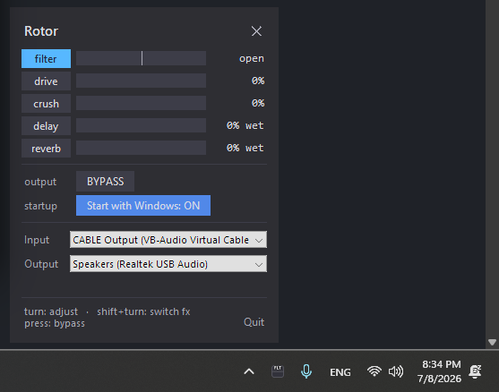
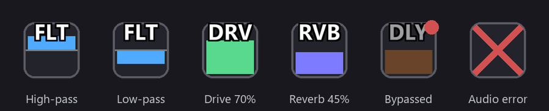

# Rotor

Turn the volume knob on your keyboard into a real-time DJ effect controller.
Software-independent - Rotor processes the audio itself, so it works on
whatever is playing on your PC.

Runs as a **system-tray app**: the tray icon is a live bar showing the active
effect (Task-Manager-CPU style); click it for a panel that updates live while
open, where you pick devices and switch effects.

> **Windows only** for now (global keyboard hook + WASAPI/DirectSound via
> PortAudio). Ports to Linux/macOS are very welcome, see [Compatibility](#compatibility).



## Download & setup
Grab the exe and do the one-time audio routing.

1. **Install VB-CABLE** (free virtual audio cable): https://vb-audio.com/Cable/
   → unzip, run the installer as admin, then reboot. This is what lets Rotor
   process everything playing on your PC.
2. **Windows → Sound → Output device = `CABLE Input`.** Now all system audio
   goes into the cable instead of straight to your speakers.
3. **Download [Rotor.exe](https://github.com/CNuhlar/Rotor/releases/latest/download/Rotor.exe)**
   and run it **as Administrator** (it asks - the knob hook needs elevation).
   Unsigned, so SmartScreen may warn → *More info → Run anyway*.
4. **Click the tray icon** (near the clock) and in the panel set
   **Input = `CABLE Output`** and **Output = your speakers/headphones**.

Done - music → CABLE → Rotor → your output, and the knob adds live effects.

**Controls:** turn = adjust · shift+turn = switch effect · press = bypass

All versions live on the [Releases](https://github.com/CNuhlar/Rotor/releases)
page.

## Compatibility
Works with **any device that sends the standard Volume Up / Down / Mute media
keys** - most keyboards with a volume knob (Keychron and others), standalone USB
volume dials, or plain keyboard media keys. Nothing here is brand-specific.

**Windows only** for now. The knob capture uses a global Windows keyboard hook
and audio runs over WASAPI/DirectSound via PortAudio, both Windows-specific. The
effect engine itself is plain Python and portable, so a Linux (evdev/PipeWire)
or macOS (CoreAudio/CGEventTap) port is very doable. PRs / contributions to port
it are welcome, open an issue if you want to take it on.

## Controls
| Action | Effect |
|---|---|
| Turn knob | Adjust the selected effect's amount (in **volume** mode, the Windows system volume) |
| **Shift** + turn | Switch effect (cycles the chain) |
| Single press (mute) | Bypass all effects / re-enable (in **volume** mode, toggles Windows mute) |

You can also switch the active effect and toggle bypass from the panel.

## Effects
Signal chain order - all stay active; Shift+turn only selects *which one* the
knob adjusts:

| Code | Effect | What it does |
|---|---|---|
| **VOL** | volume | the default mode: the knob drives the **Windows system volume** (native volume OSD), press toggles Windows mute; the tray icon/panel mirror the level |
| **FLT** | filter | open in the middle, left = low-pass (dark), right = high-pass (thin) |
| **DRV** | drive | soft-clip saturation, 0 = clean |
| **CRU** | crush | lo-fi bit-depth + sample-rate reduction, 0 = off |
| **DLY** | delay | echo, 0 = off, turn up for more wet |
| **RVB** | reverb | room/space, 0 = off, turn up for more wet |

Parameter changes are smoothed, so sweeping the knob is click-free (no zipper
noise). In bypass the tray bar dims but stays visible, so you can pre-set a
value before un-bypassing.



## For developers
Prefer to run from source or build it yourself? See *Run from source* and
*Build a standalone .exe* below.

## Run from source (optional - developers only)
The **exe above needs no Python**; this section is only if you want to run or
hack on the code. Requires Python 3.

```powershell
cd <this folder>
python -m venv .venv
.\.venv\Scripts\Activate.ps1
pip install -r requirements.txt
.\.venv\Scripts\pythonw.exe tray.py     # tray app, no console window
.\.venv\Scripts\python.exe  tray.py     # same, but keeps a console for errors
```

Run as **Administrator** so the knob's media keys can be captured (and stopped
from changing Windows' own volume). The app starts on your saved devices, or
your **system default** input/output if none are saved yet.

### Panel
- One row per effect: **click a name** to make it active; live bar + exact value
- **Bypass** - toggle all effects
- **Start with Windows** - see below
- **Input / Output** - pick devices; the choice is saved and restored next launch
- **Quit**
- Close the panel with `✕`, `Esc`, or by clicking the tray icon again

## Settings that persist
Selected **input/output devices** are saved (by name, so they survive reboots
and device reordering) to:
```
%APPDATA%\Rotor\config.json
```

## Start with Windows (auto-launch at logon)
Toggle **Start with Windows** in the panel. Because the knob needs an elevated
keyboard hook, this creates a **Scheduled Task** that runs the app at logon with
highest privileges (so no UAC prompt each time). Toggling it off removes the
task. Enabling requires the app to be running as Administrator (it already is).

## How the audio routing works
Rotor reads from an **input** and writes to an **output**. VB-CABLE (from the
setup above) sits in the middle: Windows plays into **CABLE Input**, Rotor reads
**CABLE Output**, processes it, and writes to your real speakers/headphones.

> Devices are opened via **DirectSound (shared mode)**, so a hard kill won't lock
> the audio device. We avoid WDM-KS / exclusive mode (it can wedge a USB audio
> device at the driver level until reboot).

## Console version (debugging)
`main.py` is a console-only runner that prints a live input-level meter - handy
for diagnosing device/routing problems:
```powershell
python main.py                 # saved/default devices
python main.py --list          # list audio devices
python main.py --in 3 --out 5  # by device index
python main.py --in-name "CABLE Output" --out-name "Speakers"   # by name
```
`knob_test.py` prints the raw key events your knob emits (diagnostic).

## Project layout
| File | Purpose |
|---|---|
| `tray.py` | system-tray app + live panel (main entry point) |
| `main.py` | console runner (debug / headless) |
| `engine.py` | audio engine, device enumeration/defaults, stream management |
| `effects.py` | the effect DSP (volume, filter, drive, crush, delay, reverb) |
| `knob.py` | captures the knob via a global keyboard hook |
| `winvol.py` | reads the Windows output volume/mute (ctypes Core Audio) for volume mode |
| `config.py` | persists settings to `%APPDATA%\Rotor` |
| `autostart.py` | run-at-logon Scheduled Task helper |
| `knob_test.py` | diagnostic: prints the raw key events the knob emits |

## Build a standalone .exe
```powershell
.\build.ps1        # -> dist\Rotor.exe (single file, requests admin)
```
The exe bundles Python and all dependencies; no install needed to run it. It
embeds a manifest requesting elevation (the global keyboard hook needs admin).

## Next steps
- Presets (save/recall effect combinations) - design TBD
- Knob-controllable delay time / tempo-sync
- Resonance (Q) knob for the filter

<!-- Optional: a short screen recording is worth a lot here -->
<!--  -->
